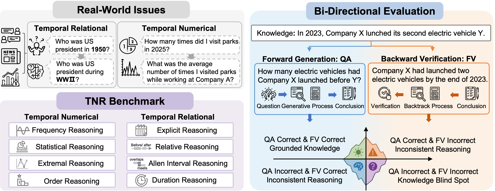
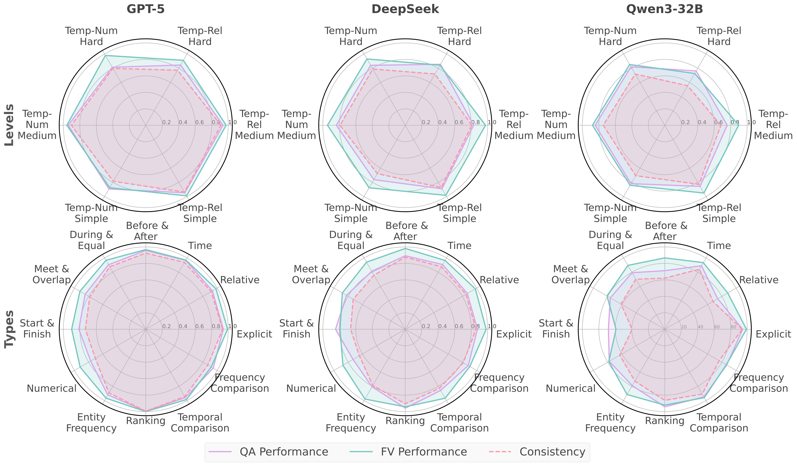
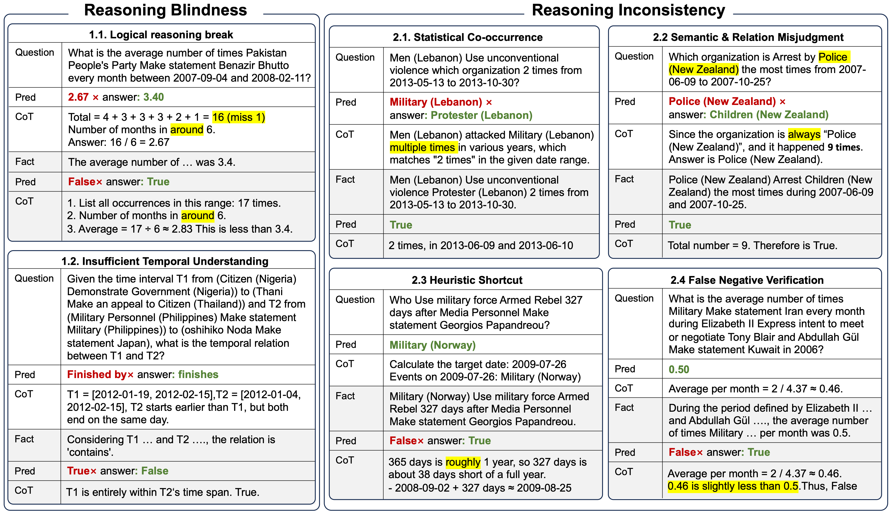

# ⏳ TNR

<h2>[ACL 2026] Beyond Timestamps: Bridging Forward and Backward Reasoning in Temporal Numerical and Relational Understanding </h2>

> 🎉🎉 **Congratulations!** This paper has been accepted to **ACL 2026 🌟🔥**.

**🌟 If you found this work helpful, please consider giving us a ⭐ on GitHub!**

## 📋 Project Information

> **Authors**: Xinying Qian, Ying Zhang, Xuhui Sui, Yu Zhao, Baohang Zhou, Jeff Z. Pan 
>
> **Affiliation**: Nankai University, Tiangong University, The University of Edinburgh 
>
> **Contact**: [qianxinying@dbis.nankai.edu.cn](mailto:qianxinying@dbis.nankai.edu.cn)

## 📖 Abstract

Temporal reasoning remains a critical challenge for large language models (LLMs), particularly when it requires encompassing relational dependencies and numerical constraints. Existing benchmarks largely overlook the joint consideration of these two dimensions and primarily rely on single-task evaluation paradigms, making it difficult to assess whether correct answers reflect grounded reasoning or arise from superficial statistical recall.To address these gaps, we introduce **TNR**, a benchmark designed to evaluate both Temporal Numerical and Relational reasoning. **TNR** proposes a bi-directional evaluation framework consisting of:

- **Forward Generation:** Question Answering (QA) 
- **Backward Verification:** Fact Verification (FV) 

By measuring the alignment between QA and FV, we introduce a **Consistency Rate (CR)** to quantify the robustness of reasoning across these two directions. Experiments reveal notable discrepancies between QA and FV performance, particularly in numerical and interval-based tasks.

  
<em>Figure 1: An overview of the TNR benchmark. We build the TNR benchmark from real-world challenges and evaluate LLMs with a bidirectional framework.</em> 
 

## 📊 Data Quantity

**📈 Dataset Statistics:**

- **Total Size:** Approximately 94k QA-FV pairs in total.
- **Splits:** Divided into training, development, and test sets in an 8:1:1 ratio.
- **Coverage:** 75,184 pairs in the training set and 9,895 pairs each in the development and test sets.

## 💪🏻 Evaluation Results

### 📊 Consistency Radar Charts

To evaluate the robustness and reliability of varying LLMs, we compare GPT-5, DeepSeek, and Qwen3-32B across different question levels and types. The radar charts below report performance metrics for QA, FV, and Consistency:

  
  
<em>Figure 3: Radar chart of GPT-5, Deepseek, and Qwen-32B performance across levels and task types.</em>

### 📉 Error Analysis

By examining the consistency between forward generation and backward verification, we categorize model error cases into two types. When both the QA and FV predictions are incorrect, we refer to this as *Reasoning Blindness*. This error type primarily stems from deficiencies in logical and temporal reasoning. When only one of the tasks is correct, we categorize the error as *Reasoning Inconsistency*, where the model exhibits partial reasoning ability but is affected by hallucinations.

  
  
<em>Figure 4: Error types in GPT-5 predictions. Errors in both QA and FV are labeled as Reasoning Blindness, while errors in only one task are labeled as Reasoning Inconsistency.</em>

