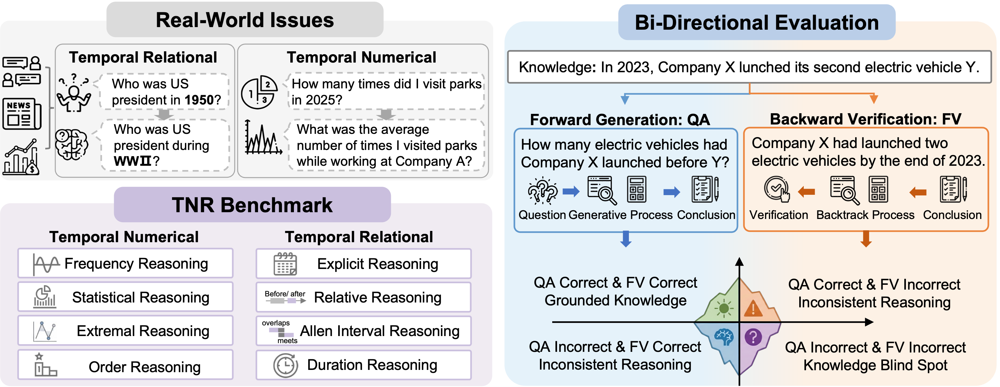
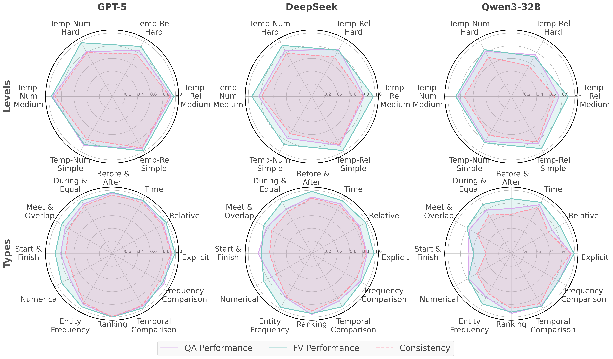
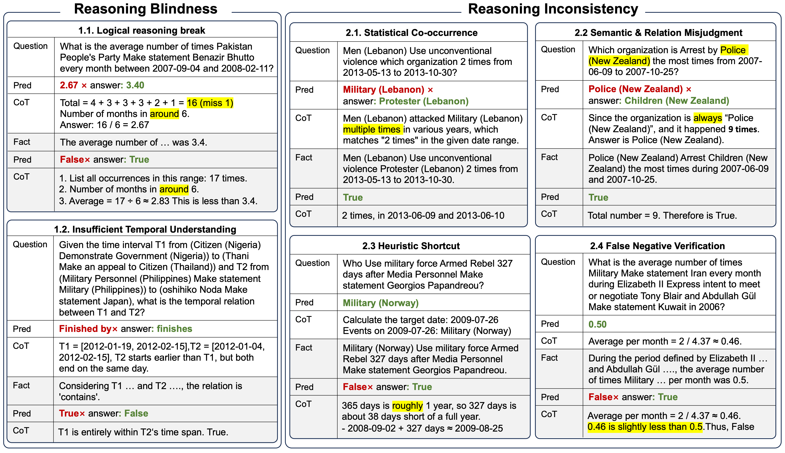

# ⏳ TNR

<h2>[ACL 2026] Beyond Timestamps: Bridging Forward and Backward Reasoning in Temporal Numerical and Relational Understanding </h2>

## 📋 Project Information

> **Authors**: Xinying Qian, Ying Zhang, Xuhui Sui, Yu Zhao, Baohang Zhou, Jeff Z. Pan 
>
> **Affiliation**: Nankai University, Tiangong University, The University of Edinburgh 
>
> **Contact**: [qianxinying@dbis.nankai.edu.cn](mailto:qianxinying@dbis.nankai.edu.cn)

## 📖 Abstract

Temporal reasoning remains a fundamental challenge for large language models (LLMs), particularly when it involves both relational dependencies and numerical constraints. Existing benchmarks largely neglect the joint modeling of these two aspects and predominantly adopt single-task evaluation settings, making it difficult to determine whether correct predictions stem from genuine reasoning or superficial statistical memorization.

To address these limitations, we introduce **TNR**, a benchmark designed to systematically evaluate temporal numerical and relational reasoning. Specifically, **TNR** adopts a bidirectional evaluation framework consisting of:

- **Forward Generation:** Question Answering (QA)  
- **Backward Verification:** Fact Verification (FV)  

To further assess reasoning robustness, we propose a **Consistency Rate (CR)** metric that measures the alignment between QA and FV predictions. Experimental results reveal substantial discrepancies between forward and backward reasoning, particularly in tasks involving numerical computation and temporal intervals.

 
 

<em>Figure 1: Overview of the TNR benchmark. The dataset is constructed based on real-world temporal reasoning challenges and evaluated under a bidirectional framework.</em>
 

## 🔄 Dataset Update

**Last updated: 2026-08-25**

We have updated the train, development, and test splits. Please use the JSON files in this directory as the current release.

## 📊 Data Quantity

**📈 Dataset Statistics:**

- **Total Size:** 93,980 QA–FV pairs  
- **Splits:** Training, development, and test sets are constructed with an 8:1:1 ratio  
- **Coverage:** 75,184 training pairs, 9,398 development pairs, and 9,398 test pairs

## 🧾 Record Schema

| Field | Type | Description |
|---|---|---|
| `id` | integer | Record ID. |
| `question` | string | QA model input. |
| `answer` | string, number, or array | QA target. |
| `claim` | string | FV model input. |
| `claim_answer` | boolean | FV target label. |
| `qa_evidence` | array | QA supporting-evidence annotation; not model input. |
| `qa_entity` | array of strings | Non-exhaustive QA retrieval metadata; not model input. |
| `qa_relation` | array of strings | Non-exhaustive QA retrieval metadata; not model input. |
| `qa_context` | string | QA model-input context containing evidence and noise facts. |
| `fv_evidence` | array | FV supporting-evidence annotation; may be empty for false claims and is not model input. |
| `fv_entity` | array of strings | Non-exhaustive FV retrieval metadata; not model input. |
| `fv_relation` | array of strings | Non-exhaustive FV retrieval metadata; not model input. |
| `fv_context` | string | FV model-input context containing evidence and noise facts. |
| `level` | string | Difficulty level. |
| `type` | string | Task type. |

## 🎯 Evaluation Inputs

For QA, provide the model with `question` and `qa_context`, and evaluate its output against `answer`. For FV, provide the model with `claim` and `fv_context`, and evaluate its output against `claim_answer`.

## 💪🏻 Evaluation Results

### 📊 Consistency Radar Charts

To evaluate the robustness and reliability of different LLMs, we compare GPT-5, DeepSeek, and Qwen3-32B across varying question types and difficulty levels. The radar charts below present performance in QA, FV, and Consistency.

  
  

  <em>Figure 3: Radar chart comparing GPT-5, DeepSeek, and Qwen3-32B across different levels and task types.</em>
  

### 📉 Error Analysis

Based on the consistency between forward generation and backward verification, we categorize model errors into two types:

- **Reasoning Blindness:** Both QA and FV predictions are incorrect, indicating failures in temporal and logical reasoning  
- **Reasoning Inconsistency:** Only one task is correct, suggesting partial reasoning ability but a lack of consistency, often due to hallucinations  

  
  

  <em>Figure 4: Error types in GPT-5 predictions. Errors in both QA and FV are categorized as Reasoning Blindness, while errors in only one task are categorized as Reasoning Inconsistency.</em>
  

